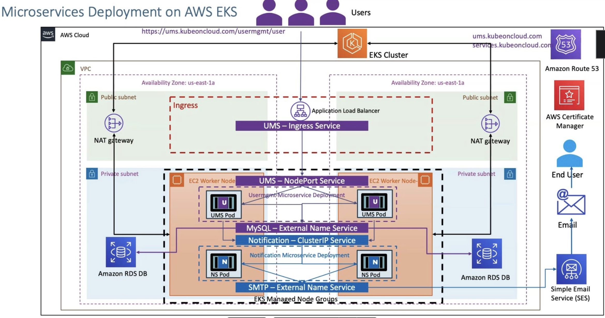

# Microservice-SMTP


## Use Argo CD to deploy Microservice manifests
1. install Argo CD
```bash
kubectl create namespace argocd
kubectl apply -n argocd -f https://raw.githubusercontent.com/argoproj/argo-cd/stable/manifests/core-install.yaml
```
Check installed seccussful
```bash
kubectl get pod -n argocd
kubectl get svc -n argocd
```
access to Argo CD UI
```bash
kubectl port-forward -n argocd svc/argocd-server 8080:443
```
get pwd for Argo CD login
```bash
kubectl get secret argocd-initial-admin-secret -n argocd -o yaml
echo <your-password> | base64 --decode
```
2. Configure ArgoCD with "Application" CRD
write the application.yaml of ArgoCD

3. Apply the Argo CD application,yaml in the cluster
```bash
kubectl apply -f application.yaml
```
4. Test our setup by updating Deployment.yaml
Your can edit image version in deployment.yaml to check the sync status in ArgoCD UI, but if we do the munal change in K8s cluster, it will be overwritten.

## Manually deploy Microservice manifests
```bash
kubectl apply -f kube-manifests/
